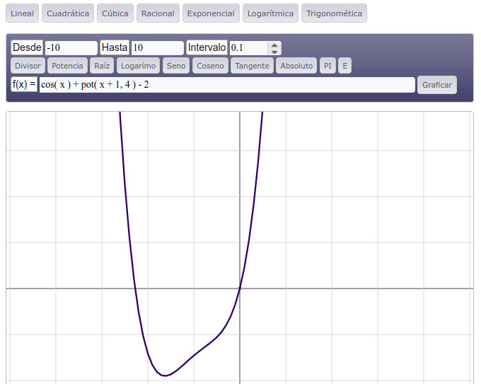

# Calculador Matemático

Calculadora de funciones, vectores, triángulos matemáticos y ley de Ohm.

---------

Instituto Técnico Industrial Laureano Gómez Castro, Aguachica - Colombia, Noviembre del 2011.
